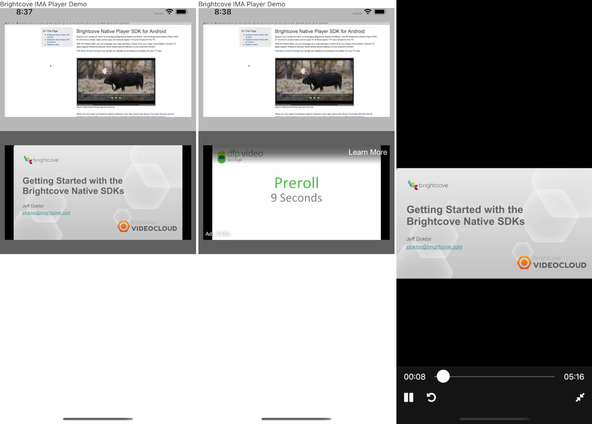

# react-native-brightcove-ima-player



React Native implementation of Brightcove Player native SDK video player.

## Brightcove SDK Version used

- Minimum Required version of iOS is 11
- iOS Brightcove-Player-IMA 6.10.6
- com.brightcove.player:android-ima-plugin 6.18.6

## Installation

```sh
npm install react-native-brightcove-ima-player
```

### iOS

- Add source to `Podfile` and `pod install && pod update`
- Specify platform version to `11.0`

```rb
source 'https://github.com/brightcove/BrightcoveSpecs.git'

platform :ios, '11.0'
```

### Android

- Add maven source to repositories in `android/build.gradle`
- [Enables multiDex](https://developer.android.com/studio/build/multidex).

```gradle
allprojects {
  repositories {
      maven {
          url 'https://repo.brightcove.com/releases'
      }
  }
}
```

## Usage

```jsx
import { BrightcoveIMAPlayer } from "react-native-brightcove-ima-player";

// ...

<BrightcoveIMAPlayer
  accountId="3636334163001"
  videoId="3666678807001"
  policyKey="BCpkADawqM1W-vUOMe6RSA3pA6Vw-VWUNn5rL0lzQabvrI63-VjS93gVUugDlmBpHIxP16X8TSe5LSKM415UHeMBmxl7pqcwVY_AZ4yKFwIpZPvXE34TpXEYYcmulxJQAOvHbv2dpfq-S_cm"
/>
```

- Video player component of Brightcove.
- It may not work on Android simulator.
- For a more detailed example, please see example app.

| Prop                   | Type     | Description                                                                         | Event Object                 |
| ---------------------- | -------- |-------------------------------------------------------------------------------------| ---------------------------- |
| accountId              | string   | Brightcove AccountId. Required                                                      |                              |
| policyKey              | string   | Brightcove PolicyKey. Required                                                      |                              |
| videoId                | string   | Brightcove VideoId to playback.                                                     |                              |
| autoPlay               | boolean  | Set `true` to play automatically                                                    |                              |
| play                   | boolean  | Control playback and pause                                                          |                              |
| fullscreen             | boolean  | Control full screen state                                                           |                              |
| volume                 | number   | Set audio volume (`0.0 ~ 1.0`)                                                      |                              |
| bitRate                | number   | Set maximum buffering bitrate. Set `0` to automatic quality                         |                              |
| adVideoLoadTimeout     | number   | Set the amount of milliseconds for video to load. Default is `3000`                 |                              |
| playbackRate           | number   | Set playback speed scale. Default is `1`                                            |                              |
| disableDefaultControl  | boolean  | Disable default player control. Set `true` when you implement own video controller. |                              |
| onAdsLoaded           | Function | Indicates the IMA ads manager has loaded                                             |                              |
| onReady                | Function | Indicates the video can be played back                                              |                              |
| onPlay                 | Function | Indicates the video playback starts                                                 |                              |
| onPause                | Function | Indicates the video is paused                                                       |                              |
| onEnd                  | Function | Indicates the video is played to the end                                            |                              |
| onProgress             | Function | Indicates the playback head of the video advances.                                  | `{ currentTime: number }`    |
| onChangeDuration       | Function | Indicates the video length is changed                                               | `{ duration: number }`       |
| onUpdateBufferProgress | Function | Indicates the video loading buffer is updated                                       | `{ bufferProgress: number }` |
| onEnterFullscreen      | Function | Indicates the player enters full screen                                             |                              |
| onExitFullscreen       | Function | Indicates the player exit full screen                                               |                              |

| Method                                | Description                       |
| ------------------------------------- | --------------------------------- |
| seekTo(timeInSeconds: number) => void | Change playhead to arbitrary time |

### BrightcovePlayerPoster

```jsx
import { BrightcoveIMAPlayerPoster } from "react-native-brightcove-ima-player";

// ...

<BrightcoveIMAPlayerPoster
  style={styles.player}
  accountId="3636334163001"
  videoId="3666678807001"
  policyKey="BCpkADawqM1W-vUOMe6RSA3pA6Vw-VWUNn5rL0lzQabvrI63-VjS93gVUugDlmBpHIxP16X8TSe5LSKM415UHeMBmxl7pqcwVY_AZ4yKFwIpZPvXE34TpXEYYcmulxJQAOvHbv2dpfq-S_cm"
  resizeMode="contain"
/>
```

- Displays a poster specified by `videoId`, `referenceId` or `videoToken`.
- Prop is about the same as `BrightcovePlayer`.

| Prop        | Type   | Description                                                                                                                                                                                                                          |
| ----------- | ------ | ------------------------------------------------------------------------------------------------------------------------------------------------------------------------------------------------------------------------------------ |
| accountId   | string | Required                                                                                                                                                                                                                             |
| policyKey   | string | Required                                                                                                                                                                                                                             |
| videoId     | string |                                                                                                                                                                                                                                      |
| referenceId | string |                                                                                                                                                                                                                                      |
| videoToken  | string |                                                                                                                                                                                                                                      |
| resizeMode  | string | Set the image resize method. Specifying `cover` or `contain` works the same as CSS keywords of `background-size`. Specifying `fit`, scales to fit the component size without considering aspect ratio of the image. Default value is `cover`. |


## Contributing

See the [contributing guide](CONTRIBUTING.md) to learn how to contribute to the repository and the development workflow.

## License

MIT
